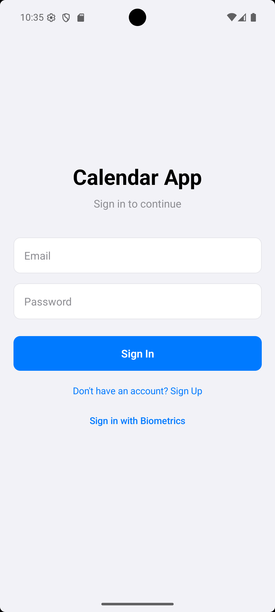
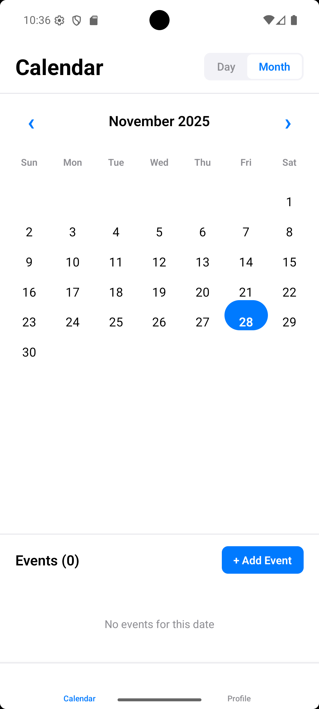
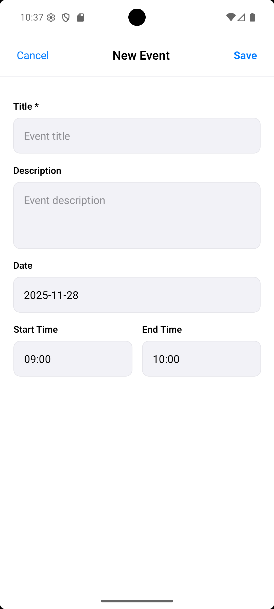
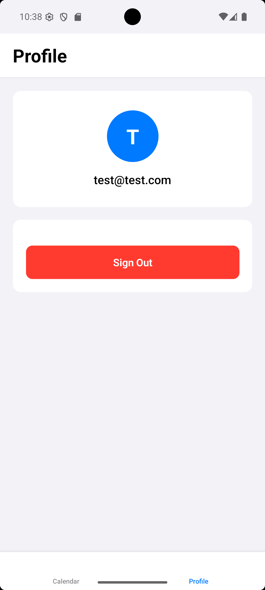

## What you need

Before you start, make sure you have:

- Node.js
- For Android: Android Studio and an Android emulator or a physical device
- For iOS (Mac only): Xcode and CocoaPods

## Setup

First, clone the repo and install dependencies:

npm install

In iOS, you need to install the iOS dependencies:

cd ios
pod install
cd ..

## Running the App

### Android

1. npm start
    Keep this terminal open.
2. npm run android
    Make sure you have an Android emulator running or device connected with USB.

### iOS (Mac only)

1. npm start
    Keep this terminal open.
2. npm run ios
    Or you can open the project in Xcode:
        open ios/TempRNProject.xcworkspaceThen.

## Running Tests

In terminal: 
npm test

## Screenshots

  
  
    
  
  

